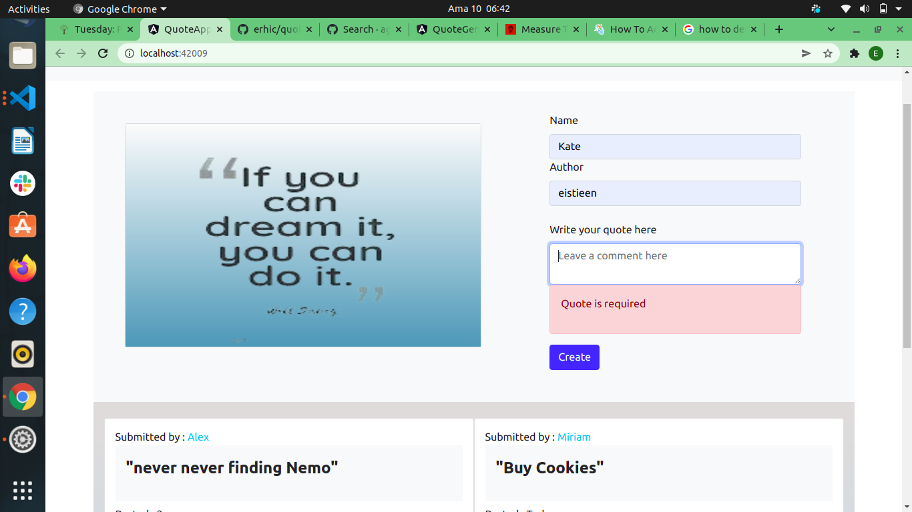

# QuoteApp

This project was generated with [Angular CLI](https://github.com/angular/angular-cli) version 13.1.2.

### Author:  [Eric N](https://github.com/erhic/Quote_App)

### Description
----
    This is a web application where one can create quotes as well as view those quotes posted and written by other people and vote them as an upvote or downvote.

  ### Demo
 

### Technologies Used
----
- HTML
- CSS
- TYPESCRIPT
- BOOTSTRAP
- ANGULAR

### Installion Process
----
* To run the application ,the required tools required is mainly a browser application example like google chrome and access to the internet. To access the aplication online <kbd>click</kbd> (https://github.com/erhic/quotes_vote_app).
The application can run a mobile device or a computer.

* To use the application offline in your local device;
*Create a folder in you local device the proceed and clone the site using the link (git clone git@github.com:erhic/quotes_vote_app.gitgit)
### Bug
----
There is no identified bug.
### Contacts
----
For feedback or any information pertaining this project feel free to reach me through :

Email: ericgichovi@moringa.student.com

### Licence 
---

[ LICENCE](LICENSE) 
 (link to MIT License )

